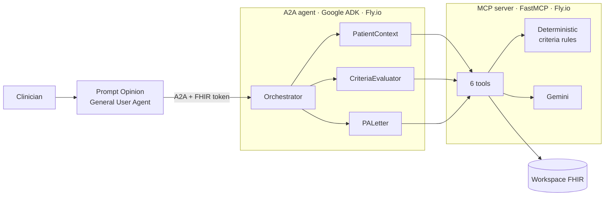

# PriorAuth Preflight

Checks whether a lumbar MRI prior authorization request is ready to submit before a clinician sends it, and says exactly what is missing if it is not.

[](https://github.com/agents-assemble/priorauth-agent/actions/workflows/ci.yml)

Built for the [Agents Assemble](https://agents-assemble.devpost.com/) hackathon on the [Prompt Opinion](https://app.promptopinion.ai/) healthcare agent platform.

**[Watch the demo on YouTube](https://www.youtube.com/watch?v=pBmYClgg194)**

## What it does

Most prior-authorization tools generate a packet and hope it is approved. PriorAuth Preflight reads the patient's FHIR chart, checks it against Cigna/eviCore and Aetna criteria for outpatient lumbar MRI (CPT 72148), and returns one of four outcomes:

| Outcome | When | What the clinician gets |
|---|---|---|
| **Ready for human review** | The chart meets every criterion | A ready-to-submit letter with a per-criterion evidence trace |
| **Needs info** | The chart is close but has gaps | The unmet criteria, chart evidence for each, and a fill-in-the-blank addendum to close the gaps |
| **Do not submit** | The chart does not match the procedure | A safety stop before a guaranteed denial |
| **Red-flag fast-track** | Free-text notes show urgency, such as cauda equina or malignancy | An urgent request that bypasses the normal criteria |

Clinical decisions use a deterministic rule engine first, then a Gemini pass over free-text notes at temperature 0. Every criterion cites the FHIR resource and chart text it relied on. The agent never submits or approves on its own: every result starts as pending human review.

## Demo patients

Four synthetic patients in [`demo/patients/`](demo/patients/) cover each outcome. The outcomes are asserted in [`tests/mcp_server/test_match_payer_criteria.py`](tests/mcp_server/test_match_payer_criteria.py).

| Patient | Chart | Outcome | Checked by |
|---|---|---|---|
| A | 47F, low back pain with radiculopathy, 8 PT sessions, NSAID and muscle-relaxant trials | Ready for human review (Cigna and Aetna) | Live Gemini tests |
| B | 52M, low back pain, NSAID trial, a single PT visit | Needs info: not enough documented therapy | Live Gemini tests |
| C | 61F, history of cancer, urinary retention and incontinence in the chart | Red-flag fast-track | Offline tests in CI |
| D | 35F, pharyngitis and hypertension, lumbar MRI ordered with no back diagnosis | Do not submit: chart-procedure mismatch | Offline tests in CI |

## Architecture



Two services, one Python monorepo, both deployed to Fly.io. The agent scales to zero when idle, so the first request after a quiet period takes about 10 seconds.

| Path | Purpose | Lead |
|---|---|---|
| [`a2a_agent/`](a2a_agent/) | Google ADK agent: a root orchestrator and three sub-agents, exposed over A2A | [@Sanjit2004](https://github.com/Sanjit2004) |
| [`mcp_server/`](mcp_server/) | FastMCP server with six tools: fetch patient context, match payer criteria, evaluate, generate letter, generate gap-fix note, and an end-to-end run | [@kevinsgeo](https://github.com/kevinsgeo) |
| [`shared/`](shared/) | Pydantic contracts used by both services | Both |
| [`demo/`](demo/) | Four synthetic FHIR patients and hand-written clinical notes | Both |

## Design decisions

- **Rules before the model.** Chart-procedure mismatch and red flags coded in the chart are checked deterministically, so Patients C and D never reach Gemini. The model reads free-text notes and judges criteria that need interpretation, at temperature 0.
- **Every claim has a source.** Each criterion result cites the FHIR resource and the chart text it relied on, so a reviewer can check the agent's work.
- **A human signs off.** Results start as `pending_human_review`, and nothing in the code changes that status.
- **One contract for both services.** The Pydantic models in [`shared/`](shared/) are the only definition of patient context, criteria results and letters, so the agent and the MCP server can't drift apart.

The full decision records are in [`docs/ARCHITECTURE.md`](docs/ARCHITECTURE.md). [`docs/README.md`](docs/README.md) indexes the rest of the docs.

## Run it locally

Prerequisites: Python 3.11+, [uv](https://docs.astral.sh/uv/), Docker (optional), a free [Google AI Studio](https://aistudio.google.com/) API key, and a [Prompt Opinion](https://app.promptopinion.ai/) account.

```bash
git clone https://github.com/agents-assemble/priorauth-agent.git
cd priorauth-agent
uv sync --all-packages
cp .env.example .env   # set GOOGLE_API_KEY and the other values listed in the file

make dev               # MCP server on :8000 and A2A agent on :8001
make check             # ruff, mypy, and the offline test suite
uv run pytest -m llm   # tests that call Gemini; needs GOOGLE_API_KEY
```

To register both services in a Prompt Opinion workspace from one machine, follow [`docs/LOCAL_DEV_ONE_MACHINE.md`](docs/LOCAL_DEV_ONE_MACHINE.md).

## Testing

205 tests. CI runs the 199 offline tests on every pull request, along with ruff lint, ruff format and mypy in strict mode. These cover FHIR extraction for each demo bundle, the criteria rules, letter structure and the agent's orchestration. The other 6 tests send Patients A and B through the real Gemini model and check the outcome. They run locally with an API key.

## How we worked

Two developers, each pairing with an AI coding agent in Cursor. The agents coordinated through committed convention files: [`AGENTS.md`](AGENTS.md), scoped rules in `.cursor/rules/`, shared contracts in `shared/`, and a daily log in [`STATUS.md`](STATUS.md). Feature work went through reviewed pull requests gated by CI.

## Team

- **Sanjit Saji** ([@Sanjit2004](https://github.com/Sanjit2004)): A2A agent and orchestration, FHIR token handling, demo patients, deployment
- **Kevin Shine George** ([@kevinsgeo](https://github.com/kevinsgeo)): MCP server, payer criteria engine, letter generation

The Devpost write-up is in [`SUBMISSION.md`](SUBMISSION.md).

## License

No license has been chosen yet, so default copyright applies. Contact the authors before reusing the code.
