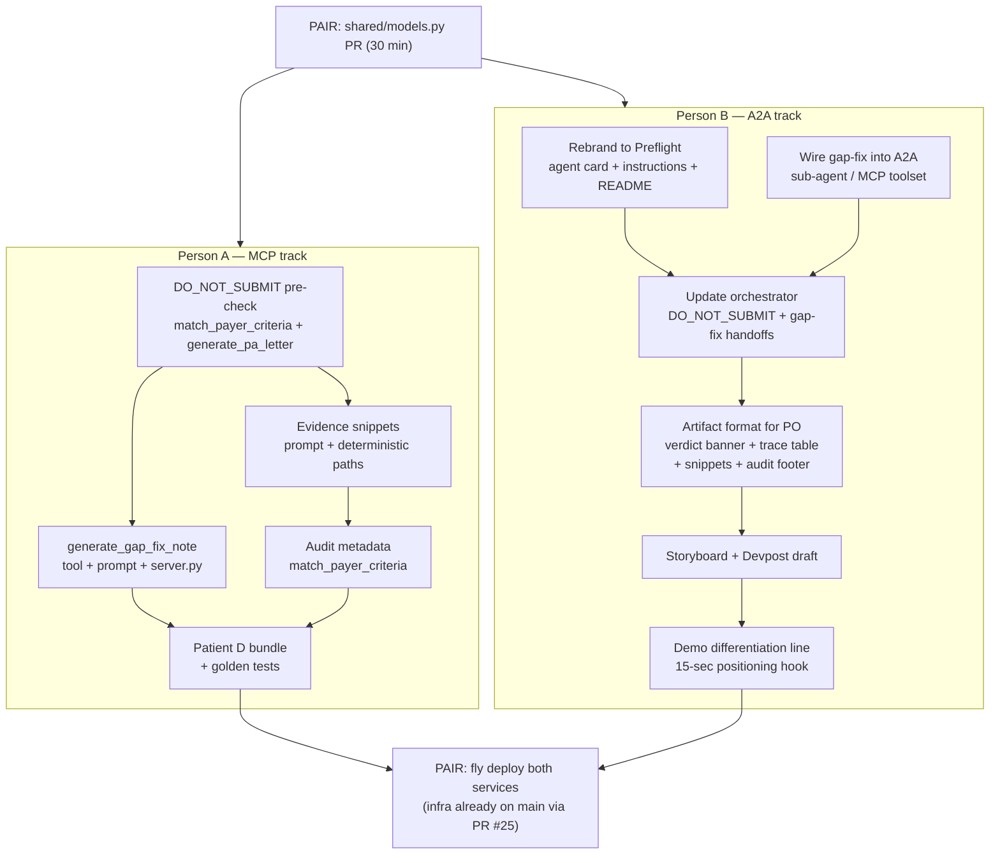

# PriorAuth Preflight — Differentiation Feature Plan

## Problem

The competitive landscape (from deep research) shows the marketplace is crowded with PA packet generators, approval scorers, and appeal writers. Our current output (approve/needs_info/deny + PA letter) is **table stakes**. The white space is: **stop bad requests before submission, show exactly why, and generate the clinician documentation needed to close gaps.**

## What We Already Have (strengths to keep)

- Deterministic red-flag fast-track (Celia demo) -- unique; most teams use a single LLM
- Per-criterion evidence in `CriterionCheck.evidence`
- Three-tier decision (approve / needs_info / deny)
- Two payers (Aetna + Cigna) with real policy citations
- Visible multi-agent handoff in ADK traces
- Combined `evaluate_prior_auth` single-call tool

## Parallelization Strategy

Work splits cleanly along existing CODEOWNERS after one shared gate PR.

**Why this split works:**

- Person A owns `mcp_server/` — all 4 new features are MCP tool changes, prompts, criteria logic, and test fixtures
- Person B owns `a2a_agent/` — rebrand, A2A wiring, orchestration updates, and demo/Devpost prep
- Zero cross-ownership conflicts after the shared gate PR
- Both tracks run fully in parallel once `shared/models.py` merges

---

## Phase 0: Gate PR (pair, 30 min) — BLOCKS EVERYTHING

Update [`shared/models.py`](shared/models.py) (requires both reviewers per CODEOWNERS):

- `Decision` enum: add `DO_NOT_SUBMIT = "do_not_submit"`
- `CriterionCheck`: add `source_document: str | None = None`, `snippet: str | None = None`
- `CriteriaResult`: add `evaluated_at: str | None = None`, `policy_version_tag: str | None = None`, `evidence_sources_used: list[str] = Field(default_factory=list)`, `review_status: str = "pending_human_review"`
- New model: `GapFixNote` (decision, template_text, fields_to_complete, rendered_markdown)

All additive (new optional fields + new enum value + new model). Existing consumers and tests will not break.

---

## Person A Track (MCP) — runs after gate merges

### A1. DO_NOT_SUBMIT Safety Gate + Chart-Mismatch Detection

**Files:** [`mcp_server/tools/match_payer_criteria.py`](mcp_server/tools/match_payer_criteria.py), [`mcp_server/tools/generate_pa_letter.py`](mcp_server/tools/generate_pa_letter.py), [`mcp_server/prompts/generate_pa_letter_v1.md`](mcp_server/prompts/generate_pa_letter_v1.md)

- Deterministic pre-check at the top of `match_payer_criteria`, before red-flag or Gemini: intersect `context.active_conditions` codes against `coverage_gating.covered_icd_patterns` from payer JSON. If zero matches AND zero red-flag candidates -> return `DO_NOT_SUBMIT` with evidence "No documented lumbar symptoms or qualifying spine indication in the chart."
- Add `DO_NOT_SUBMIT` branch to `generate_pa_letter`: short notice (not a full letter), urgent-style banner "Do Not Submit", no sections beyond a one-paragraph explanation.

**Effort:** ~50-80 lines, 1-2 hours.

### A2. Clinician Gap-Fix Template Tool (the "killer feature")

**Files:** new [`mcp_server/tools/generate_gap_fix_note.py`](mcp_server/tools/generate_gap_fix_note.py), new [`mcp_server/prompts/generate_gap_fix_note_v1.md`](mcp_server/prompts/generate_gap_fix_note_v1.md), [`mcp_server/server.py`](mcp_server/server.py)

- New MCP tool `generate_gap_fix_note(criteria_result_json, patient_context_json) -> GapFixNote`
- Prompt instructs Gemini to produce a fill-in-the-blank clinical addendum template (episode summary, conservative treatment completed, response to treatment, current findings, red-flag review) with `[bracketed placeholders]` for unfilled fields
- Register in `server.py`

**Effort:** ~120-150 lines + prompt, half a day.

### A3. Evidence Snippets with Source Citations

**Files:** [`mcp_server/prompts/match_criteria_v1.md`](mcp_server/prompts/match_criteria_v1.md), [`mcp_server/tools/match_payer_criteria.py`](mcp_server/tools/match_payer_criteria.py)

- Update prompt: instruct Gemini to populate `source_document` (FHIR resource type + date or code) and `snippet` (short quoted chart text) for each `CriterionCheck`
- Update deterministic paths (red-flag fast-track, unknown payer, DO_NOT_SUBMIT) to populate `source_document` from the structured data they already reference

**Effort:** ~30-40 lines, 2-3 hours.

### A4. Audit Metadata

**Files:** [`mcp_server/tools/match_payer_criteria.py`](mcp_server/tools/match_payer_criteria.py)

- After building `CriteriaResult`: set `evaluated_at` to ISO-8601 now, `policy_version_tag` from criteria JSON metadata, `evidence_sources_used` from which FHIR resource types returned non-empty data, `review_status = "pending_human_review"`

**Effort:** ~25 lines, 1-2 hours.

### A5. Patient D Demo Bundle + Golden Tests

**Files:** new `demo/patients/patient_d.json`, new `demo/clinical_notes/patient_d.md`, test files

- 4th patient: sore-throat chart (Condition J02.0 streptococcal pharyngitis) + a ServiceRequest for CPT 72148 lumbar MRI. Coverage: Cigna.
- Golden tests: `test_match_payer_criteria` for DO_NOT_SUBMIT, `test_generate_gap_fix_note`, evidence snippets present on existing patient tests, audit fields populated.
- **Critical verification:** Patient B (M54.50 + NSAID trial, missing PT) must still route to `NEEDS_INFO` (not `DO_NOT_SUBMIT`) after the chart-mismatch pre-check. M54 is in `covered_icd_patterns` so it should pass, but pin this in a named test assertion.

**Effort:** ~100 lines bundle + tests, half a day.

---

## Person B Track (A2A) — runs after gate merges, fully parallel with Person A

### B1. Rebrand as "PriorAuth Preflight"

**Files:** [`a2a_agent/agent.py`](a2a_agent/agent.py), agent card JSON, [`README.md`](README.md), [`a2a_agent/README.md`](a2a_agent/README.md)

- Rename agent from "Prior Auth (Lumbar MRI)" to "PriorAuth Preflight — Lumbar MRI" in PO workspace registration
- Update root instruction wording: "denial-prevention preflight" framing
- Update agent card description and skills
- Update README hero line and architecture description

**Effort:** 30-60 minutes.

### B2. Wire Gap-Fix into A2A

**Files:** [`a2a_agent/mcp_patient_context.py`](a2a_agent/mcp_patient_context.py), [`a2a_agent/sub_agents/criteria_evaluator.py`](a2a_agent/sub_agents/criteria_evaluator.py) or new `a2a_agent/sub_agents/gap_fix.py`

- Bind `generate_gap_fix_note` MCP tool in a toolset (same pattern as `evaluate_prior_auth` binding)
- Either extend `criteria_evaluator` instruction to call gap-fix when result is `needs_info` / `do_not_submit`, OR create a small 4th sub-agent `gap_fix_agent` that the orchestrator hands off to after criteria returns needs_info
- Simpler approach (recommended): extend `criteria_evaluator` — one sub-agent calls evaluate then gap-fix in sequence, avoiding an extra handoff

**Effort:** ~60-80 lines, 2-3 hours.

### B3. Update Orchestrator for New Flows

**Files:** [`a2a_agent/agent.py`](a2a_agent/agent.py), [`a2a_agent/orchestration.py`](a2a_agent/orchestration.py)

- Root instruction must know about `DO_NOT_SUBMIT` as a possible outcome
- If criteria_evaluator returns `needs_info` or `do_not_submit`, the response to PO should include the gap-fix template in the artifact text (not just the criteria result)
- Update `_deterministic_transfer` or orchestrator instruction to reflect the expanded flow

**Effort:** ~30 lines, 1-2 hours.

### B4. Artifact Format for PO Display (CRITICAL)

**Why this matters:** Judges see **only** what appears in the PO chat artifact. `CriterionCheck.source_document` and `snippet` are internal JSON fields — invisible unless the A2A response artifact renders them. Without this task, all of Person A's evidence-snippet and audit work is invisible to judges.

**Files:** [`a2a_agent/sub_agents/criteria_evaluator.py`](a2a_agent/sub_agents/criteria_evaluator.py), [`a2a_agent/agent.py`](a2a_agent/agent.py)

- Format the response artifact to include:
  - **Verdict banner** (APPROVE / NEEDS_INFO / DO_NOT_SUBMIT / RED FLAG with appropriate urgency)
  - **Criteria trace table** — each policy clause with status (met/missing), evidence snippet, and source document reference
  - **Gap-fix template** inline when decision is `needs_info` or `do_not_submit`
  - **Audit footer** — "Pending human review. Policy: aetna_lumbar_mri.v2026. Evaluated: [timestamp]."
- This can be done in the criteria_evaluator sub-agent instruction or in a post-processing step that formats the structured JSON into readable text

**Effort:** ~60-80 lines of instruction/formatting, 2-3 hours.

### B5. Storyboard + Devpost Draft

**Files:** [`demo/`](demo/) storyboard doc, `SUBMISSION.md`

- Revised storyboard per the research report: lead with needs-info + gap-fix (the differentiator), not happy path
- 4-patient demo order: DO_NOT_SUBMIT (instant red banner) -> NEEDS_INFO + gap-fix (money shot) -> APPROVE (audit trail) -> RED FLAG (fast-track)
- Draft Devpost copy with the positioning: "We prevent avoidable denials and tell clinicians exactly what to fix"

**Effort:** 2-3 hours writing.

### B6. Demo Differentiation Line

**Why:** Without an explicit positioning statement, judges mentally group us with "another PA packet generator." This 15-second hook in the demo intro prevents that.

- Add to demo script opening: *"Most PA agents generate packets. PriorAuth Preflight decides whether a lumbar MRI packet should be generated at all, then fixes missing documentation first."*
- Reinforce in Devpost intro paragraph

**Effort:** 15 minutes (but high leverage).

---

## What We Do NOT Build

- **PAS-light export** — medium-high effort, "no longer unique on its own" per report
- **Batch queue** — high effort, invisible in a 3-min demo
- **Third payer** — Cigna + Aetna is enough for portability
- **Full autonomous submission** — report explicitly warns against claiming this

---

## Timeline (parallel execution)

- **May 2 (today):** Plan approval. Gate PR (shared/models.py). Both start tracks.
- **May 3-4:** Person A ships A1-A4 as 1-2 PRs. Person B ships B1-B3 as 1-2 PRs.
- **May 5:** Person A ships A5 (Patient D + tests). Person B ships B4 (artifact format) + B5 (storyboard draft).
- **May 6:** PAIR: Fly.io deploy + PO URL swap + integration smoke on all 4 patients. B6 (differentiation line) finalized.
- **May 7-8:** Demo video + Devpost.
- **May 9:** Internal ship date (48-hr buffer).
- **May 11:** Hackathon deadline.
