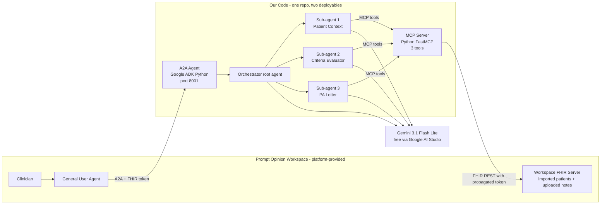

## Strategic Framing (why this wins)

Prior Auth is the ideal hackathon target: physicians spend ~13 hrs/week on it, 94% of clinicians report care delays, and it's a textbook "last-mile" workflow — exactly the language the hackathon landing page uses. It scores on all three judging criteria:

- **AI Factor**: missing-info reasoning and letter synthesis genuinely need GenAI (pure rules fail on unstructured clinical notes).
- **Impact**: quantifiable (hours saved, denial-rate reduction, care-delay reduction).
- **Feasibility**: maps cleanly onto real FHIR, real public payer criteria (AIM/eviCore/Cigna lumbar MRI), real CMS-10114-style letters.

### Submission strategy — one focused Devpost entry, two marketplace listings

- **Devpost submission (the only one)**: Option 3 — custom external A2A Agent. This is the complete workflow story judges grade.
- **Marketplace listings (two)**: the A2A Agent **and** the underlying MCP toolkit, both published via PO's Marketplace Studio so judges browsing the ecosystem discover both. MCP is framed as "the superpower our agent uses," not a competing submission.
- **Why one Devpost, not two**: $7.5K grand prize rewards narrative clarity and depth, not breadth. Splitting attention across two entries dilutes polish during crunch week. The A2A submission already showcases the MCP tools inside it — we get credit without a second writeup.

### Three differentiators we lean on (the rest of the field will not)

1. **Needs-info feedback loop** — most PA submissions will do binary approve/deny; we return a specific, actionable missing-evidence checklist tied to cited criteria.
2. **Red-flag fast-track** — real clinical intelligence that surfaces cauda equina / malignancy / suspected infection from free-text notes and bypasses normal criteria.
3. **Visible multi-agent handoff** — three sub-agents inside our A2A process, handoffs visible in ADK traces; most teams will ship a single monolithic agent.

## Team Collaboration (two humans + two AI coding agents)

Both teammates work in Cursor with AI agents. The collaboration constraint is: **agents have zero shared memory across users or sessions — the only way they stay aligned is via committed files that both agents auto-read every session.** Solving this up front kills most collaboration risk.

### The split — one deployable per person, minimal conflict surface

| Area | Person A (MCP lead) | Person B (A2A lead) |
|---|---|---|
| Week 1 | `mcp_server/` scaffold, `fetch_patient_context`, FHIR client + token handling | Platform spike, ADK fork, agent card, ngrok, PO registration |
| Week 2 | `match_payer_criteria`, `generate_pa_letter`, criteria JSON, golden tests | Orchestrator + 3 ADK sub-agents, handoff logic, Gemini prompt tuning |
| Week 3 | Deploy MCP to Fly.io, publish to marketplace, demo storyboard draft, Devpost review | Deploy A2A to Fly.io, publish to marketplace, record demo video, write Devpost entry |
| Shared (pair) | `shared/` contracts (Day 1), demo patient authoring (Week 1), weekly integration checkpoints, capability check (Week 2 Day 1) | Same |

Person B has a heavier Week 3 (demo + writeup). Balance by Person A pre-drafting the storyboard and Devpost outline so Person B polishes rather than writes from scratch.

### The shared brain — 7 files committed on Day 1 (before any feature code)

Both teammates' Cursor agents auto-read these on every session. If knowledge isn't committed here, it's invisible to the teammate's agent.

1. **`AGENTS.md`** — master instructions both agents follow automatically (tech stack locks, directory ownership, contract rules, LLM hygiene, commit conventions, what-not-to-touch). ~100 lines.
2. **`shared/models.py`** — Pydantic contracts: `PatientContext`, `CriteriaResult`, `PALetter`, plus request/response schemas for every MCP tool and every ADK handoff. Both deployables import from here; no local duplication.
3. **`.cursor/rules/`** — 3–4 small file-pattern-scoped rules (python-style, fhir-client, adk-agents, commit-messages).
4. **`CODEOWNERS`** — GitHub enforces reviewer requirements mechanically: `mcp_server/` → A, `a2a_agent/` → B, `shared/` + `AGENTS.md` + `.cursor/rules/` → both.
5. **`docs/PLAN.md`** — committed mirror of this plan so the teammate's agent can read the strategic context.
6. **`docs/po_platform_notes.md`** — append-only log of Prompt Opinion quirks. Every platform discovery gets written here in the same PR so future sessions (yours or teammate's) don't rediscover it.
7. **`STATUS.md`** — daily 3-line report per person (what I did / what's broken / what's next). Agents read at session start to get fresh context.

### `AGENTS.md` essentials (what it must contain)

- **Context**: hackathon, deadline, architecture link.
- **Session-start protocol**: read STATUS.md first, then docs/PLAN.md if unsure of strategy, then docs/po_platform_notes.md if touching PO integration.
- **Tech stack locks**: Python 3.11, uv, ruff, pytest, FastMCP, Google ADK, Gemini 3.1 Flash Lite. Do not swap without PR.
- **Directory ownership** (matches CODEOWNERS).
- **Contract rule**: never duplicate types from `shared/`; always import.
- **LLM hygiene**: temperature 0 on criteria + letter tools, structured outputs, model name from env var only.
- **Commit convention**: Conventional Commits, PRs ≤ 400 LOC, no deleting tests to make them green.
- **Knowledge capture rule**: new PO platform learnings go into `docs/po_platform_notes.md` in the same PR.
- **What NOT to touch without both reviewers**: `shared/`, `fly.toml`, agent-card env vars, CI workflow, AGENTS.md itself.

### Daily + weekly cadence

- **End of day (each person)**: append 3 lines to `STATUS.md` — done / blocked / next.
- **Start of day (each person)**: pull `main`, read teammate's STATUS entry, run `make integration` to catch contract drift before it becomes a merge war.
- **Weekend integration checkpoint** (pair, 30–60 min): full end-to-end run in the PO workspace against all 3 demo patients. Fix anything broken *together* before the next week's solo work.

### Agent hygiene specifics

- **Both teammates use the same model family** (both on Claude 4.7 Sonnet, or both on GPT-5.4). Style consistency matters — different models write different code for the same rule.
- **Small focused PRs** (≤ 400 LOC). Agents love to generate massive PRs; resist it. Many small obviously-correct PRs beat one huge one.
- **CI enforces what AGENTS.md says** — ruff + mypy + pytest + golden-file checks fail PRs that violate conventions. Machine enforcement > polite rules.
- **Cursor BugBot / PR review** enabled on PRs to catch issues before human review. Cheap extra pass with two agents producing code fast.
- **Do not run parallel refactors on `shared/`** — coordinate over chat before touching shared contracts.

### Credentials + platform sharing

- **Google AI Studio**: each person has their own free API key (one per Gmail). Same model name via `GEMINI_MODEL` env var.
- **Fly.io**: one org, both as members. Deploys from `main` via GitHub Actions — neither person deploys from their laptop.
- **Prompt Opinion**: one shared workspace account via password manager (Bitwarden/1Password). Check if PO has native team features and use them if available.
- **GitHub**: both as collaborators on the private repo.

## Architecture (Option 3 — custom external A2A agent)

Prompt Opinion owns the left side (user, general agent, workspace FHIR). We own the right side entirely in code. The **three-agent story lives inside our A2A process** — not as three separately configured PO agents — and the handoffs are visible in ADK traces.

## Tech Stack (locked)

- **Language**: Python 3.11+
- **A2A framework**: Google ADK (Python), forked from Prompt Opinion's A2A reference repo
- **MCP framework**: FastMCP (Python), forked from the "PO community MCP" reference repo
- **LLM**: Gemini 3.1 Flash Lite via Google AI Studio (free tier). Fallback to a larger Gemini tier only if capability check fails in Week 2 Day 1.
- **FHIR source**: Prompt Opinion workspace FHIR server (the workspace *is* a FHIR server). Import synthetic patients via PO's UI; upload hand-authored clinical notes as `DocumentReference` via the patient page.
- **Auth**: SHARP token propagation — enabled via "pass token" checkbox when registering our MCP and A2A agent in PO; our code reads the token and uses it on FHIR calls.
- **Dev exposure**: ngrok tunnels for local development.
- **Prod exposure**: Fly.io public HTTPS (required by Week 3 for stable judging invocations; ngrok is not acceptable for judging).
- **Testing**: pytest + golden-file tests on tool outputs.
- **Observability**: ADK built-in traces for agent handoffs; structured JSON logs on MCP tool calls.

## FHIR Resources + Exact Fields

Target workflow: **Lumbar MRI (CPT 72148) for low back pain (ICD-10 M54.5x / M51.x)**.

- **Patient**: `id`, `birthDate`, `gender` — age gating and letter header.
- **Condition**: filter `code` in {M54.50, M54.51, M51.16, M51.17, G83.4 cauda equina, C79.51 mets to spine}; read `onsetDateTime` (need ≥ 6 weeks duration), `clinicalStatus`, `verificationStatus`.
- **Observation**: pain scores (LOINC 72514-3), neuro exam findings, weight/BMI.
- **MedicationRequest** / **MedicationStatement**: NSAIDs, muscle relaxants, gabapentinoids — conservative-therapy criterion. Filter by RxNorm classes.
- **Procedure**: prior physical therapy (CPT 97110, 97140), epidural injections (CPT 62323).
- **ServiceRequest**: the MRI order itself — `code` 72148, `reasonCode`, `authoredOn`, `requester`.
- **DocumentReference**: prior imaging reports (LOINC 24531-6 MR Lumbar) and **hand-authored clinical notes we upload** that contain red-flag narrative (saddle anesthesia, bowel incontinence, progressive weakness). These are the free-text substrate for the LLM reasoning pass.
- **Coverage**: payer identification — drives which criteria set to apply.
- **Encounter**: clinical context for letter narrative.

Downstream: bundled into a compact `PatientContext` JSON (~2–3 KB) so sub-agents reason over clean input, not raw FHIR bloat.

## MCP Tool Design (the real code)

One Python package, `mcp_server/`, exposing exactly three tools via FastMCP. Surface area stays small on purpose.

### Tool 1: `fetch_patient_context(patient_id, service_code) -> PatientContext`

- Hits PO workspace FHIR using the propagated SHARP token (no separate auth).
- Deterministic extraction produces normalized JSON: `{demographics, active_conditions, conservative_therapy_trials[], prior_imaging[], red_flag_candidates[], service_request, coverage}`.
- Red-flag candidate detection combines structured codes (cauda equina ICD) **and** a cheap Gemini pass on `DocumentReference.content` + `Condition.note` for phrases like "saddle anesthesia", "bowel/bladder incontinence", "progressive weakness". Candidates are flagged — the criteria evaluator makes the final call.

### Tool 2: `match_payer_criteria(patient_context, payer_id, service_code) -> CriteriaResult`

- Loads payer-specific criteria from versioned JSON in `mcp_server/data/criteria/` (`cigna_lumbar_mri.json`, `aetna_lumbar_mri.json`). Source policy URL cited inline in each JSON file; criteria paraphrased, not copied verbatim (IP hygiene).
- Two-stage evaluation:
  1. **Deterministic rule engine** — age, diagnosis code present, duration ≥ 6 weeks, conservative-therapy count, prior-imaging window.
  2. **Gemini reasoning pass** — adjudicates ambiguous criteria against `red_flag_candidates` and free-text notes. This is the explicit AI-Factor moment for judges.
- Returns `{decision: "approve" | "needs_info" | "deny", criteria_met[], criteria_missing[], red_flag_fast_track: bool, confidence: 0–1, reasoning_trace}`.

### Tool 3: `generate_pa_letter(patient_context, criteria_result, clinician_note?) -> PALetter`

- Gemini-generated CMS-10114-style PA letter: patient header, diagnosis + ICD, requested service + CPT, clinical justification tying each met criterion to specific evidence in context, attachments list, signature block.
- Three output branches:
  - `approve` → submittable letter (HTML + JSON).
  - `needs_info` → prominent "Information Needed" checklist instead of letter body; cites which payer criterion each missing item maps to.
  - `red_flag_fast_track` → urgency banner citing the specific red flag at the top of the letter.
- Output is both structured JSON (machine-consumable) and rendered HTML (what PO displays).

## A2A Agent Orchestration (in code, not in PO UI)

Inside our Google-ADK agent, four internal agents:

- **Orchestrator (root)** — receives the A2A request from PO's general agent, decides which sub-agent to hand off to based on state. Enforces the retrieval → evaluation → letter sequence.
- **Patient Context Sub-agent** — bound to MCP tool `fetch_patient_context`. System prompt: *"Clinical data retrieval specialist. Given a patient and requested service, fetch and return the normalized context exactly as your tool produces. No interpretation."*
- **Criteria Evaluator Sub-agent** — bound to MCP tool `match_payer_criteria`. System prompt: *"Prior-authorization criteria evaluator. Given patient context and payer, invoke your tool and return the decision, met criteria, missing criteria, and red flags. Never fabricate evidence."*
- **PA Letter Sub-agent** — bound to MCP tool `generate_pa_letter`. System prompt: *"Prior-authorization writer. Given context and criteria result, produce the ready-to-submit PA letter (or needs-info checklist). Cite every claim against the context — no unsupported assertions."*

This decomposition is **entirely inside our code** — PO sees one external A2A agent; the three-sub-agent story is visible through ADK traces in our demo, not through PO's UI.

## Demo Data Strategy (solves the narrative-realism gap)

The PO workspace supports importing patients and uploading documents per patient via the UI. This directly kills the Synthea narrative-thinness bottleneck — we author the clinical notes ourselves.

Three curated patients (imported + enriched in PO workspace):

- **Patient A — Happy path**: 47F, M54.50 low back pain with 12-week duration, 8 PT sessions, NSAID + muscle-relaxant trial, no red flags. Expected output: clean approval letter.
- **Patient B — Needs-info**: 52M, M54.50 with 10-week duration, NSAID trial, **no documented PT**. Expected output: needs-info checklist flagging PT as missing evidence. Demo shows clinician uploading a PT note via DocumentReference then re-running → approved.
- **Patient C — Red-flag fast-track**: 61F, M54.51 with malignancy history (C79.51), and a hand-authored clinical note that says "patient reports new saddle numbness and difficulty controlling bladder". Expected output: red-flag banner, criteria bypassed, urgent submission letter.

All three patients committed as FHIR bundles to `demo/patients/` for reproducibility, and imported into PO workspace during Week 1.

## 3-Week Execution Schedule

Deadline: **May 11, 2026 @ 11:00pm EDT**. Plan ships by May 9 (48-hr buffer).

### Week 1 — De-risk the platform, build the skeleton (Apr 22 – Apr 29)

- **Day 1 AM — Team bootstrap (pair, 1–2 hrs, BLOCKING all other work)**:
  - Create private GitHub repo with both as collaborators and branch protection on `main`.
  - Pair-author `AGENTS.md`, `shared/models.py` (Pydantic contracts), `CODEOWNERS`, `.cursor/rules/` skeleton, `STATUS.md` template, `docs/PLAN.md` (committed mirror of this plan), `docs/po_platform_notes.md` (empty), `.env.example`, `docker-compose.yml`, `Makefile` with `dev` + `integration` targets.
  - Commit as PR #1. Both review. Merge. This is the shared brain both agents will read from here on.
- **Day 1 PM – Day 2 — Platform spike (Person B leads, stop-the-line milestone)**:
  - Sign up on `app.promptopinion.ai`, create Google AI Studio API key, add Gemini 3.1 Flash Lite to PO.
  - Fork PO community MCP repo into `mcp_server/`, fork PO Google-ADK A2A reference repo into `a2a_agent/`.
  - Run both locally, expose via ngrok, register both in PO workspace ("pass token" checkbox ON for both).
  - Confirm end-to-end: clinician chat → general agent → consults external A2A agent → A2A agent calls MCP tool → MCP tool calls workspace FHIR with propagated token → returns data.
  - **Success gate**: if this round-trip doesn't work by end of Day 2, stop and email `support@promptopinion.ai` + Discord before writing any more code.
- **Day 2 (Person A in parallel)**: set up `.github/workflows/ci.yml` (ruff + mypy + pytest + golden-file checks), confirm it blocks a broken PR.
- **Day 3–4 (pair)**: Import 3 demo patients into PO workspace; hand-author and upload clinical notes (esp. red-flag narrative for Patient C). Both need to agree on exact clinical content since it drives every downstream test.
- **Day 5–7 (solo, in parallel)**:
  - Person A: implement `fetch_patient_context` against PO workspace FHIR; confirm normalized output on all 3 patients; golden-file tests land.
  - Person B: stub the ADK sub-agents with pass-through handoffs; confirm trace visibility; wire Gemini Flash Lite into the root agent.

### Week 2 — Intelligence (Apr 29 – May 6)

- **Day 1 — Model capability check (pair, 1 hr)**: run Gemini 3.1 Flash Lite on sample criteria reasoning + letter generation against all 3 patients. If quality is weak, escalate to a bigger Gemini tier **now** (not later). Reassess cost; Google AI Studio still has generous free tiers.
- **Day 2–5 (solo, in parallel)**:
  - Person A: encode `cigna_lumbar_mri.json` and `aetna_lumbar_mri.json` with source policy URLs cited inline; build `match_payer_criteria` (rule engine + Gemini reasoning pass) with golden-file tests; build `generate_pa_letter` with three output branches + golden-file tests.
  - Person B: replace ADK sub-agent stubs with real handoff logic; tune Gemini prompts per role; write integration tests that exercise the full chain end-to-end against one patient.
- **Day 6 weekend — Integration checkpoint (pair, 30–60 min)**: run the full flow in the PO workspace against all 3 demo patients; fix any contract drift or schema mismatches; update `docs/po_platform_notes.md` with anything new.
- **Day 7 end of Week 2 — Production deploy**:
  - Person A: deploy MCP server to Fly.io public HTTPS.
  - Person B: deploy A2A agent to Fly.io public HTTPS.
  - Pair: swap ngrok URLs for Fly URLs in PO workspace, confirm stability, commit `fly.toml` for both services.

### Week 3 — Polish, publish, submit (May 6 – May 11)

- **Day 1 (pair)**: Publish A2A agent + MCP toolkit to PO Marketplace Studio (two listings, one Devpost submission). Person A drafts demo storyboard + Devpost outline in parallel so Person B has material to work from.
- **Day 2–3 (pair)**: End-to-end rehearsal against all 3 demo patients inside PO workspace. Verify ADK traces render cleanly. Fix any integration gaps. Person A leads storyboard refinement; Person B leads technical rehearsal.
- **Day 4 (Person B records, Person A supports)**: Record <3 min demo video per storyboard. Multiple takes; edit deterministically. No live runs in the final video.
- **Day 5 (Person B writes, Person A reviews)**: Write single focused Devpost submission (problem, architecture, impact numbers, differentiation callouts, marketplace links). Internal review pass.
- **Day 6 (May 9)**: **Submit** to Devpost. 48-hour buffer remaining before the May 11 deadline for any last fixes.

## Demo Video Storyboard (<3 min, pre-recorded)

Leads with the needs-info case — that's the differentiator most teams will not have.

- **0:00–0:20** — Problem hook: "Physicians spend 13 hrs/week on prior auth. 94% say it delays care."
- **0:20–0:35** — Show PO workspace, our A2A agent + MCP both registered in marketplace, ADK trace panel visible.
- **0:35–1:15** — **Patient B needs-info case (lead)**: clinician requests PA, agent returns specific missing-evidence checklist, clinician uploads PT note, re-runs → approved. Differentiation moment.
- **1:15–1:55** — **Patient A happy path**: clean approval letter in seconds, ADK trace shows 3-sub-agent handoff.
- **1:55–2:25** — **Patient C red-flag**: narrative note triggers cauda equina detection, criteria bypassed, urgent banner.
- **2:25–2:50** — Impact slide: "20+ min of manual PA → under 30 seconds. Built on MCP + A2A + FHIR. Live in the PO marketplace."
- **2:50–3:00** — Logo + marketplace link + CTA.

## Risk Register + Mitigations

Updated after watching PO's getting-started video — several Tier 1 risks dropped, two new ones elevated.

### Dropped / lowered

- **Platform-UI unknowns** — the video confirms the three integration paths, agent-card flow, token propagation, and marketplace publishing. Residual risk handled by Day-1 spike.
- **Synthea narrative thinness** — solved by uploading hand-authored clinical notes via PO's per-patient document UI.
- **LLM cost** — eliminated (Gemini free tier).

### Active risks

- **ngrok instability during judging** → mandatory Fly.io deployment by end of Week 2; ngrok URLs removed from PO workspace before marketplace publish.
- **Gemini 3.1 Flash Lite capability ceiling** → Week 2 Day 1 is a hard capability check; escalate to a bigger Gemini tier immediately if criteria reasoning or letter generation is weak.
- **Google ADK learning curve** → mitigated by starting from PO's working reference repo, not a blank page; Day-1 spike forces us to run their code before writing our own.
- **LLM nondeterminism blowing the demo** → low-temperature prompts, structured output schemas, golden-file tests per patient, **all demo video segments pre-recorded** (no live runs in the final video).
- **Payer criteria accuracy + IP** → paraphrase (don't copy) Cigna/Aetna criteria; cite source policy URL in each JSON; cross-check against public ACR Appropriateness Criteria; ideally one clinician review before Week 3.
- **Competing PA submissions** → diluted by leading the demo with needs-info (not happy path), emphasizing visible multi-agent handoffs, and reporting a concrete latency number (20+ min manual → <30 sec).
- **Scope creep** → locked to 2 payers × 1 procedure. Anything else is v2.
- **Teammate's agent ignoring conventions / silent schema drift** → mitigated by (a) Day-1 AGENTS.md + CODEOWNERS so both agents auto-read the same rules, (b) CI mechanically enforcing what AGENTS.md says (ruff + mypy + pytest + golden files), (c) weekend integration checkpoints catching drift within 7 days max, (d) `shared/models.py` as the single source of truth for cross-service types.
- **Week 3 bottleneck on Person B (demo + writeup)** → mitigated by Person A pre-drafting the storyboard and Devpost outline during Week 3 Day 1 so Person B polishes rather than writes from scratch.

## Repo Layout

Single repo, two deployables (`mcp_server/` and `a2a_agent/`), shared contracts in `shared/`, plus the team-collaboration "shared brain" files at the root.

**Shared brain (committed Day 1, read by both agents every session):**

- `AGENTS.md` — master instructions both Cursor agents auto-read
- `CODEOWNERS` — mechanical review enforcement on GitHub
- `.cursor/rules/` — scoped rule files (python-style, fhir-client, adk-agents, commit-messages)
- `STATUS.md` — daily 3-line-per-person status
- `docs/PLAN.md` — committed mirror of this plan
- `docs/po_platform_notes.md` — append-only Prompt Opinion quirks log

**Shared contracts:**

- `shared/` — Pydantic models (`PatientContext`, `CriteriaResult`, `PALetter`, MCP tool schemas, ADK handoff schemas). Both deployables import from here; no local duplication.

**Deployable 1 — MCP server (Person A):**

- `mcp_server/` — FastMCP server (forked from PO community MCP)
  - `server.py` — MCP entrypoint, 3 tool registrations
  - `tools/fetch_patient_context.py`
  - `tools/match_payer_criteria.py`
  - `tools/generate_pa_letter.py`
  - `fhir/client.py` — thin FHIR client reading the propagated SHARP token from request headers
  - `data/criteria/cigna_lumbar_mri.json`
  - `data/criteria/aetna_lumbar_mri.json`
  - `prompts/` — externalized Gemini prompts with version tags
  - `Dockerfile`, `fly.toml`

**Deployable 2 — A2A agent (Person B):**

- `a2a_agent/` — Google ADK Python agent (forked from PO reference)
  - `agent.py` — root/orchestrator agent + 3 sub-agents + handoffs
  - `card.json` — agent card (skills, endpoints) served from public URL
  - `middleware.py` — API key enforcement (used when PO registers us)
  - `Dockerfile`, `fly.toml`

**Shared demo + infra:**

- `demo/patients/` — 3 FHIR bundles (A/B/C) for reproducible PO workspace imports
- `demo/clinical_notes/` — hand-authored notes uploaded to PO per-patient (source of truth for red-flag narrative)
- `tests/` — pytest against 3 patients, golden-file letter tests, integration tests exercising the full chain
- `.github/workflows/ci.yml` — ruff + mypy + pytest + golden-file checks on every PR
- `docker-compose.yml` — local dev stack (MCP + A2A + optional ngrok)
- `Makefile` — `make dev`, `make integration`, `make test`, `make deploy`
- `README.md` — architecture diagram, setup instructions, judging narrative
- `SUBMISSION.md` — Devpost copy draft, impact numbers, marketplace links, differentiation callouts
- `.env.example`, `pyproject.toml`

## What I need from you to start Week 1

1. Confirm this plan (or tell me what to change).
2. A project path for the repo (e.g., `C:\Users\Sanjit Saji\projects\priorauth-agent`) — I'll bootstrap with `create_project` and move the workspace there.
3. Who is **Person A** (MCP lead) and who is **Person B** (A2A lead) so I can write it into the initial AGENTS.md and CODEOWNERS.
4. Your teammate's GitHub username for collaborator invite + CODEOWNERS.
5. Confirm both of you will use the **same Cursor model** (e.g., both on Claude 4.7 Sonnet) for style consistency.
6. A free Prompt Opinion account on `app.promptopinion.ai` (only needed before Day-1 spike; I don't need creds).
7. A free Google AI Studio API key for Gemini 3.1 Flash Lite (each person gets their own free key; you paste into your own `.env`; I scaffold the shared config).
